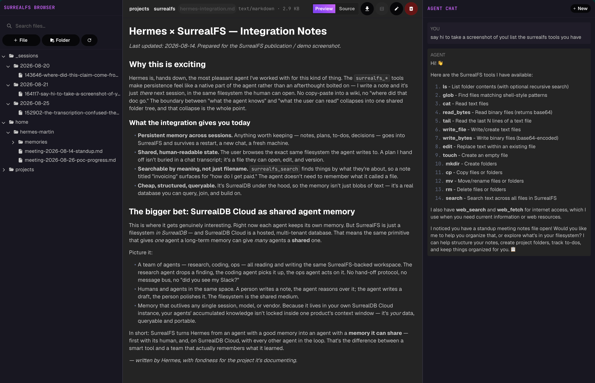

<br>

<p align="center">
    
</p>

<h1 align="center">SurrealDB file system</h1><br/>
<p align="center">A filesystem-based memory layer for agents, with hybrid search, backed by SurrealDB.</p>

<br>

<p align="center">
    <a href="https://surrealdb.com"></a>
    &nbsp;
    <a href="https://github.com/surrealdb/surrealfs/blob/main/examples/semantic_search.py"> </a>
    &nbsp;
    <a href="https://github.com/surrealdb/surrealfs/blob/main/surrealfs/integrations/pydantic_ai/README.md"></a>
    &nbsp;
    <a href="https://github.com/surrealdb/surrealfs/blob/main/surrealfs/integrations/hermes/README.md"></a>
    &nbsp;
    <a href="https://github.com/surrealdb/surrealfs/blob/main/surrealfs/integrations/json_tools/README.md"></a>
    &nbsp;
    <a href="https://github.com/surrealdb/surrealfs/blob/main/surrealfs/integrations/json_tools/README.md"></a>
</p>

<br>

<p align="center">
    <a href="https://surrealdb.com/discord"></a>
    &nbsp;
    <a href="https://x.com/surrealdb"></a>
    &nbsp;
    <a href="https://www.linkedin.com/company/surrealdb/"></a>
    &nbsp;
    <a href="https://www.youtube.com/@SurrealDB"></a>
</p>

Give an agent somewhere durable to keep its work. SurrealFS is a `file` table
plus the tools to hand it to a model — files and folders, full-text and semantic
search, all queryable with SurrealQL because it is just a table.



*The file browser is a standalone tool that can be used to browse and edit files in a SurrealDB database.*

## Requirements

- Python 3.12+
- A SurrealDB 3.x server.

## Install

```bash
pip install surrealfs                    # core, and the Hermes plugin
pip install "surrealfs[pydantic-ai]"     # + the pydantic-ai toolset
pip install "surrealfs[browser]"         # + the file browser
```

## Quickstart

Start a database (`just db`), then:

```python
from surrealdb import AsyncSurreal
from surrealfs import SurrealFs, apply_schema

db = AsyncSurreal("ws://localhost:8000/rpc")
await db.signin({"username": "root", "password": "root"})
await db.use("surrealfs", "demo")
await apply_schema(db)  # defines the `file` table; safe to re-run

fs = SurrealFs(db, user="alice")  # who you are; ROOT bypasses permissions
await fs.write_text("/notes/today.md", "# Today\n- ship the refactor")
await fs.edit("/notes/today.md", "ship", "shipped")
await fs.ls("/notes")
await fs.search_text("refactor")
```

You create and own the connection. SurrealFS never connects, signs in, or
selects a namespace.

`user` is required and has no default. Files carry a unix owner and mode, and
the database cannot tell SurrealFS who is asking — every credential is a system
credential — so the identity comes from you. See [Permissions](#permissions).

## The plain async API

`SurrealFs` returns structured `FileEntry` and `SearchHit` objects, not
pre-formatted strings. Build whatever integration you like on top.

|          |                                                               |
| -------- | ------------------------------------------------------------- |
| Read     | `read_text` `read_bytes` `tail` `ls` `glob` `stat` `exists`   |
| Write    | `write_text` `write_bytes` `edit` `touch` `mkdir`             |
| Organise | `mv` `cp` `rm` `chmod`                                        |
| Search   | `search` `search_text` `search_semantic` `reindex_embeddings` |

## Integrations

Four ways to hand it to an agent, each with its own README:

|                                                                          |                                                                       |                          |
| ------------------------------------------------------------------------ | --------------------------------------------------------------------- | ------------------------ |
| **[pydantic-ai](surrealfs/integrations/pydantic_ai/README.md)**          | a `FunctionToolset`, with recoverable mistakes raised as `ModelRetry` | `surrealfs[pydantic-ai]` |
| **[Raw JSON tool schemas](surrealfs/integrations/json_tools/README.md)** | plain dicts in Anthropic or OpenAI shape, no framework                | core                     |
| **[Hermes](surrealfs/integrations/hermes/README.md)**                    | the 14 `surrealfs_*` tools plus a bundled notes skill                 | core                     |
| **[Hermes memory](surrealfs/integrations/hermes_memory/README.md)**      | files every completed turn, and recalls context before each one       | core                     |

The first three tool surfaces are generated from one registry in
`surrealfs/tools/`, so they cannot drift apart. Tool descriptions are markdown in
`surrealfs/tools/docs/` — edit them as prose; they are prompt text. The memory
provider is the odd one out: it exposes no tools of its own, because the Hermes
plugin's already cover explicit reads and writes.

## The file browser

Point the agents at a shared SurrealDB —
a Cloud instance, say — and every person on the team can run the browser on their
own machine to see and edit the same filesystem the agents are writing to:

```bash
pip install "surrealfs[browser]"
surrealfs-browser                # http://127.0.0.1:7933
```

Tree on the left, file on the right, chat with the note-taking agent on the far
right. Text is editable and saves back to the table, markdown renders with a
source toggle, agent-authored HTML renders in a sandboxed iframe, images display,
and the search box is the same hybrid `fs.search` the agent's own tool calls.
Conversations are files too, under `/_sessions/` — open one from the tree and it
replays.

Credentials come from a `.env` in the working directory, or the environment
directly, which wins over the file:

```bash
SURREALDB_URL=wss://….surreal.cloud/rpc
SURREALDB_USER=…
SURREALDB_PASS=…
SURREALDB_NAMESPACE=…
SURREALDB_DATABASE=…
SURREALDB_AUTH_LEVEL=database    # root (default) | namespace | database
OPENAI_API_KEY=…                 # optional: makes search hybrid
ANTHROPIC_API_KEY=…              # optional: enables the chat panel
```

`SURREALDB_AUTH_LEVEL` picks which kind of user the credentials are, since the
server infers that from the signin payload — a database-scoped Cloud credential
needs `database`. All three are system users, which is why SurrealFS enforces
permissions itself rather than leaning on the database; `SURREALFS_USER` (or
`--user`) picks who the browser acts as, defaulting to root, which sees every
private home. Every variable has a command-line form too
(`surrealfs-browser --help`).

The server binds loopback. `--host 0.0.0.0` exposes it, and then anyone who can
reach the port has whatever access those credentials do — the page has no login
of its own.

## Semantic search

SurrealFS never calls an embedding model. You provide the function, so you pick
the provider:

```python
count = await fs.reindex_embeddings(embed, version="openai:text-embedding-3-small")
hits = await fs.search("how do I get paid", vector=await embed("how do I get paid"))
```

`fs.search` runs both arms and fuses them by rank — full-text scores are BM25 and
vector scores are distances, so there is nothing sane to normalise. Without a
`vector` it is full-text only. `search_text` and `search_semantic` remain
available if you want one arm on its own.

The full-text arm matches a file that shares **any** term with the query, so
`"how do I get paid"` returns candidates even without embeddings — the vector arm is
what makes it rank the invoicing note by _meaning_ rather than by shared words. That
default favours recall because the caller sees a ranked list of snippets and can
dismiss a weak hit at a glance, but cannot dismiss one it never saw.

Ranking is Okapi BM25, computed in Python over the tokens SurrealDB's own analyzer
produces for the query and each matching file — the same stemming the index matched
with, so a file saying "Prefers" scores for a query of "prefer" instead of scoring
zero. Rare words count for more than common ones, repetition saturates, and long
files are not rewarded for sprawl. Stopwords still match; they just get no vote.

What it cannot do is read intent: a query word that is beside the point still pulls
in files dense with it. That is the vector arm's job.

Pass `match="all"` when you want a precise filter and an empty result is a real
answer:

```python
hits = await fs.search("invoice 2026", match="all")  # both terms must appear
```

Re-running the indexer is cheap: it skips files whose content has not changed
since they were embedded. Agents get one `search` tool either way; pass the
embedder in the context and opt in to make it hybrid —
`build_fs_toolset(semantic=True)` with `ToolContext(fs=fs, embed=embed)`. See
`examples/semantic_search.py`.

An OpenAI embedder ships in `surrealfs.embed` (`make_embedder`,
`text-embedding-3-small`, the 1536 dimensions the HNSW index expects), along with
a daemon that keeps every vector current no matter what wrote the row:

```bash
just embed              # poll every 5s; --once for a single pass
```

It needs `OPENAI_API_KEY` and an already-applied schema (`just schema`). Under
Hermes there is no daemon to leave running — see [Keeping the vectors current
under Hermes](docs/hermes-indexer.md).

## Permissions

Files carry a unix `owner` and `mode`, and `SurrealFs` enforces them.

```
drwx------  alice          -  /home/alice/      private, created that way
-rw-rw-rw-  alice          -  /home/alice/x.md  unreachable anyway: see the 0700 above
drwxrwxrwx  bob            -  /projects/        shared, the default everywhere else
```

Every folder directly under `/home` is somebody's home and is created `0700`.
Everything else defaults to `0777`/`0666` — the shared tree is how agents hand
work to each other, so sharing is the default and privacy is opt-in:

```python
await fs.chmod("/projects/draft", 0o700)  # mine only
await fs.chmod("/notes/policy.md", 0o644)  # everyone reads, I write
```

Agents get the same thing as a `chmod` tool, and `ls` with `long` prints the
mode and owner — as above — so a model can see what it is changing.

The rules are the unix ones an agent already expects. A folder's bits govern
everything inside it, so a `0700` folder hides its whole subtree whatever the
files in it say. `rm` is keyed on the containing folder rather than the file.
Only the owner may `chmod`. `ROOT` bypasses every check, and the indexer and the
browser run as root because they are meant to see the whole tree.

`user` is required on the constructor because the database cannot supply it —
a root/namespace/database *system* credential bypasses table permissions
entirely, so the identity comes from the process.

### Upgrading a database that already has files

The schema applies itself, but rows written before `owner` and `mode` existed
need a one-off backfill — including closing any existing `/home/<user>`:

```bash
python -m surrealfs.schema --migrate
```

A fresh database needs nothing. See `surrealfs/schema/migrate_permissions.surql`.

### Letting the database enforce it too (optional)

The above is a real boundary for an agent — no tool exposes raw SurrealQL — but
not one against anyone holding the database credential. If several agents share
a database, opt in:

```bash
python -m surrealfs.schema --record-auth   # adds the `user` table + record access
python -m surrealfs.users add alice        # creates alice and /home/alice (0700)
```

```bash
SURREALDB_AUTH_LEVEL=record SURREALDB_USER=alice SURREALDB_PASS=…
```

Now SurrealDB itself refuses to return or modify anything in another user's
home, whatever query it is asked. Nothing else changes: the tools, the modes
and `chmod` behave the same, and `SurrealFs` picks its identity up from the
credential instead of the environment. Deployments that do not opt in are
unaffected — the permissions clause is inert for system credentials.

`docs/permissions.md` records why the checks live in Python, how the computed
`gate` field does ancestor traversal in one column, what the database layer
does and does not cover, and the two things deliberately left out.

## The schema

`surrealfs/schema/file.surql` is the whole data model, and it is worth reading.
The key idea: a file's `parent` is a record link and `path` is a **computed**
field derived from the parent chain. Nothing stores a path, so renaming or
moving a folder is a single `UPDATE` and every descendant's path follows for
free.

```surql
DEFINE FIELD path ON file COMPUTED (
    ($this.parent.path || '') + '/' + <string>$this.filename
) TYPE string;
```

A folder is just a row with no `content`, no `file` bytes, and no `symlink` —
also computed, as `is_folder`. `hash` is maintained by an event, and there are
HNSW and BM25 indexes for the two search modes.

`owner`, `mode` and the computed `gate` are the permission model — see
[Permissions](#permissions) below and `docs/permissions.md`.

You can apply it without writing any code:

```bash
python -m surrealfs.schema                     # uses SURREALDB_* env vars
python -m surrealfs.schema --print             # dump the DDL, connect to nothing
```

## Development

```bash
just db        # start SurrealDB in one terminal
just schema    # apply the file table to it
just test      # run the suite (starts its own server if needed)
just check     # lint + test
just browser   # the file browser on :7933
just agent     # the note-taking chat agent on :7932
just loop "…"  # the framework-free Anthropic tool-use loop
```

Tests start a throwaway `surreal` server; set `SURREALFS_TEST_URL` to reuse one
you already have.
